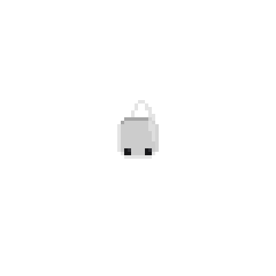

# Critical Hit!

A pixel-art dice battle game that runs entirely in your browser. No installs, no
dependencies, no server — each game is a single self-contained HTML file. Open it
and roll.

## The games

| File | Mode |
|---|---|
| [`critical_hit_dice_game.html`](critical_hit_dice_game.html) | **Duel** — head-to-head dice battle |
| [`critical_hit_boss_test.html`](critical_hit_boss_test.html) | **Boss battle only test** |

## How to Play

1. Download (or clone) this repo.
2. Double-click either `.html` file — it opens in your browser.
3. Everything else is on-screen.

### The Duel

You and the **Enemy** each start at **50 HP**. Your dice rolls deal damage to the
Enemy; after each of your rolls the Enemy rolls 4 dice back and damages you. Cut
the Enemy down before your own HP hits 0.

### Your Turn

Set your bet (steps of 50), then pick **1, 2, or 4 dice**.

- **Dmg Roll** — the dice total is damage dealt to the Enemy.
- **Heal Roll** — heal yourself that many HP instead (*once per fight*, like a
  potion). You still take the Enemy's counter. Roll a 4 of a Kind or Straight
  while healing and it's **doubled**!
- Reach the **kill zone (45–49)**, then hit **Strike** to finish.
- **Overkill** — go past 50 and the excess reflects to your own HP.

**Rewards** (payout = bet × multiplier)

| Roll | Payout |
|---|---|
| 4 of a Kind | 10× |
| Straight | 5× |
| Exactly 50 | 5× |
| 45–49 (Strike) | 2× |
| Over 50 | Reflects damage |
| Your HP 0 | You perish |

### Challenge the Boss

Win **3 fights** (they don't have to be in a row — watch the ● ● ● tracker) to
unlock a **Boss Fight**. The Boss has **100 HP** and hits just as hard — about a
1-in-4 shot, but every reward is **doubled**.

- **Limit Break** — a 4th dice option that rolls **12 dice at once**, as a Dmg or
  Heal roll. Once per boss fight.
- Heal freely in boss fights (no one-potion limit).
- Kill zone widens to **90–99**; perfect kill at exactly **100**.

| Roll | Payout |
|---|---|
| 4 of a Kind | 20× |
| Straight | 10× |
| Exactly 100 | 10× |
| 90–99 (Strike) | 4× |

Start with **1000 gil**. Lose it all and it's game over — Revive at 1000 and
fight on.

## License

[MIT](LICENSE)
