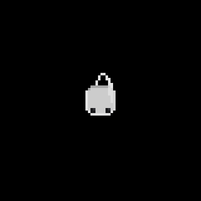

<div align="center">

# 🎲 Critical Hit!

**A pixel-art dice battle that runs entirely in your browser.**

No installs, no dependencies, no server. Each game is one self-contained HTML
file. Open it and roll.

### [▶ Play now](https://its-shadedjade.github.io/critical-hit/)



</div>

## 🗺️ Map

- [`🎮 The games`](#-the-games)
- [`⚔️ The duel`](#-the-duel)
- [`👹 The boss`](#-the-boss)
- [`💾 Running it offline`](#-running-it-offline)
- [`📝 License`](#-license)

## 🎮 The games

Two modes, both playable in the browser with one click.

| Play | Mode | File |
|---|---|---|
| [▶ Duel](https://its-shadedjade.github.io/critical-hit/critical_hit_dice_game.html) | Head-to-head dice battle, then the boss | [`critical_hit_dice_game.html`](critical_hit_dice_game.html) |
| [▶ Boss test](https://its-shadedjade.github.io/critical-hit/critical_hit_boss_test.html) | The boss fight on its own | [`critical_hit_boss_test.html`](critical_hit_boss_test.html) |

You start with **1000 gil**. Lose it all and it is game over. Revive at 1000
and fight on.

## ⚔️ The duel

You and the Enemy each start at **50 HP**. Your rolls damage the Enemy. After
each of yours, the Enemy rolls 4 dice back at you. Cut them down before your own
HP reaches 0.

Set your bet in steps of 50, then pick **1, 2 or 4 dice**.

- **Dmg Roll:** the dice total is damage dealt.
- **Heal Roll:** heal that many HP instead. Once per fight, like a potion. You
  still take the counter. A 4 of a Kind or Straight while healing is **doubled**.
- **Strike:** reach the kill zone at 45 to 49, then strike to finish.
- **Overkill:** go past 50 and the excess reflects onto your own HP.

Payout is your bet times the multiplier.

| Roll | Payout |
|---|---|
| 4 of a Kind | 10× |
| Straight | 5× |
| Exactly 50 | 5× |
| 45–49 (Strike) | 2× |
| Over 50 | Reflects damage |
| Your HP hits 0 | You perish |

## 👹 The boss

Win **3 fights** to unlock it. They do not have to be in a row. Watch the
● ● ● tracker.

The Boss has **100 HP** and hits about as hard, roughly a 1-in-4 shot. Every
reward is doubled.

- **Limit Break:** a fourth dice option rolling **12 dice at once**, as damage
  or heal. Once per boss fight.
- Heal freely. No one-potion limit here.
- Kill zone widens to **90–99**. A perfect kill is exactly 100.

| Roll | Payout |
|---|---|
| 4 of a Kind | 20× |
| Straight | 10× |
| Exactly 100 | 10× |
| 90–99 (Strike) | 4× |

## 💾 Running it offline

Clone the repo and double-click either `.html` file. It opens in your browser
and everything else is on screen. There is nothing to install.

```sh
git clone https://github.com/its-shadedjade/critical-hit.git
```

## 📝 License

[MIT](LICENSE)
